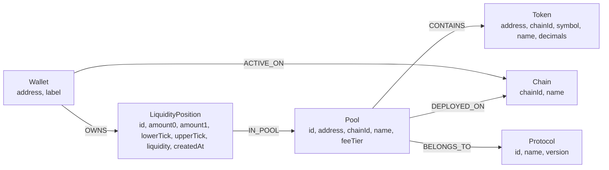
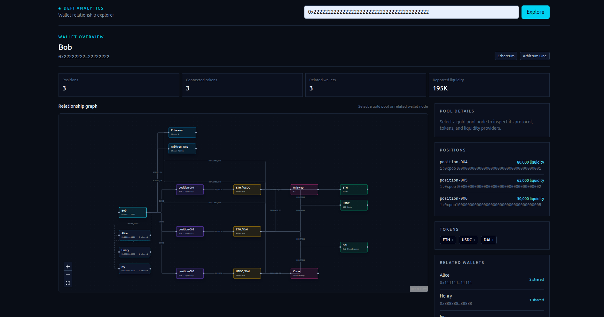

# DeFi Wallet Relationship Explorer

A full-stack explorer for discovering how DeFi wallets are connected through shared liquidity-pool positions. Enter a seeded wallet address to inspect its liquidity positions, tokens, pools, and other wallets that provide liquidity to the same pools. The interactive graph makes those paths explorable rather than burying them in a list of joins.

The project contains:

- a React + Vite interface with an interactive relationship graph;
- an Express API using the official Neo4j JavaScript driver; and
- a managed [CognoDB](https://cognodb.com/developers) graph database queried with Cypher over Bolt.

## Use case

This is a DeFi liquidity-relationship investigation tool. Given a wallet, an analyst can answer questions such as:

- Which pools does this wallet provide liquidity to?
- Which tokens, chains, and protocols is it exposed to through those positions?
- Which other wallets share one or more of its pools, and how many pools do they share?
- Who provides liquidity to a selected pool, and how much liquidity do they supply?

The repository includes deterministic demo data: 10 labeled wallets, Ethereum, Arbitrum One, and Base, three protocols, tokens, pools, and liquidity positions. Start with Alice at `0x1111111111111111111111111111111111111111`.

## Why a graph database?

The central question in this product is a traversal, not a row lookup: **wallet → liquidity position → pool ← liquidity position ← other wallet**. In a relational model this is possible, but each new relationship-oriented question requires joining the positions table to itself and then joining pools, tokens, protocols, and chains. Queries grow more verbose as the number of hops changes, and the domain model is spread across foreign keys and join tables.

CognoDB represents those connections directly as typed relationships. Cypher makes the traversal visible in the query pattern, and expanding from a wallet to related pools, providers, tokens, protocols, or further wallet hops is a natural extension of the same graph. This is especially useful for exploration, where the useful next hop is not always known in advance.

CognoDB is Bolt- and Cypher-compatible, so this application uses the standard `neo4j-driver` without a database-specific SDK. [CognoDB’s developer guide](https://cognodb.com/developers) describes provisioning an instance and connecting with a `bolt+s://` URI.

## Graph data model

### Diagram



### Nodes and properties

| Label               | Purpose                                  | Key properties                                                                          |
| ------------------- | ---------------------------------------- | --------------------------------------------------------------------------------------- |
| `Wallet`            | An LP owner across one or more chains.   | `address` (unique), `label`                                                             |
| `LiquidityPosition` | A wallet’s individual deposit in a pool. | `id` (unique), `amount0`, `amount1`, `lowerTick`, `upperTick`, `liquidity`, `createdAt` |
| `Pool`              | A deployable liquidity market.           | `id` (`chainId:address`), `address`, `chainId`, `name`, `feeTier`                       |
| `Token`             | A chain-specific asset.                  | `address`, `chainId`, `symbol`, `name`, `decimals`                                      |
| `Chain`             | A blockchain network.                    | `chainId` (unique), `name`                                                              |
| `Protocol`          | The exchange protocol that owns a pool.  | `id` (unique), `name`, `version`                                                        |

`Pool.id` deliberately combines chain ID and address, since an address alone is not a globally safe pool identity. Tokens are likewise modeled with both address and chain ID.

### Typed relationships

| Relationship  | From → To                      | Meaning                                       |
| ------------- | ------------------------------ | --------------------------------------------- |
| `OWNS`        | `Wallet` → `LiquidityPosition` | The wallet owns the LP position.              |
| `IN_POOL`     | `LiquidityPosition` → `Pool`   | The position supplies liquidity to that pool. |
| `ACTIVE_ON`   | `Wallet` → `Chain`             | The wallet has activity on that network.      |
| `CONTAINS`    | `Pool` → `Token`               | The pool contains this token.                 |
| `DEPLOYED_ON` | `Pool` → `Chain`               | The pool exists on this chain.                |
| `BELONGS_TO`  | `Pool` → `Protocol`            | The pool is managed by this protocol.         |

Schema constraints for `Chain`, `Wallet`, `Protocol`, and `LiquidityPosition` are in [`database/schema/constraints.cypher`](database/schema/constraints.cypher).

## Main graph queries

The API keeps Cypher alongside the data-access services. The most useful traversals are:

| UI/API capability | Traversal                                                                                                    | What it returns                                                                |
| ----------------- | ------------------------------------------------------------------------------------------------------------ | ------------------------------------------------------------------------------ |
| Wallet profile    | `(Wallet)-[:ACTIVE_ON]->(Chain)`                                                                             | The selected wallet and networks where it is active.                           |
| Positions         | `(Wallet)-[:OWNS]->(LiquidityPosition)-[:IN_POOL]->(Pool)`                                                   | All positions owned by a wallet and their pools.                               |
| Tokens            | `(Wallet)-[:OWNS]->(LiquidityPosition)-[:IN_POOL]->(Pool)-[:CONTAINS]->(Token)`                              | Distinct token exposure implied by the wallet’s pool positions.                |
| Related wallets   | `(Wallet)-[:OWNS]->(LiquidityPosition)-[:IN_POOL]->(Pool)<-[:IN_POOL]-(LiquidityPosition)<-[:OWNS]-(Wallet)` | Other wallets connected through shared pools, ranked by distinct shared pools. |
| Pool details      | `(Pool)-[:CONTAINS]->(Token)`, `(Pool)-[:BELONGS_TO]->(Protocol)`, `(Pool)-[:DEPLOYED_ON]->(Chain)`          | Selected pool metadata and its connected entities.                             |
| Pool providers    | `(Wallet)-[:OWNS]->(LiquidityPosition)-[:IN_POOL]->(Pool)`                                                   | Providers, number of positions, and summed liquidity for a selected pool.      |

For example, the related-wallets traversal implemented in [`apps/api/src/services/wallet.service.ts`](apps/api/src/services/wallet.service.ts) is:

```cypher
MATCH (target:Wallet {address: $address})
      -[:OWNS]->(:LiquidityPosition)
      -[:IN_POOL]->(pool:Pool)
      <-[:IN_POOL]-(:LiquidityPosition)
      <-[:OWNS]-(other:Wallet)
WHERE other.address <> target.address
RETURN other.address, other.label, count(DISTINCT pool) AS sharedPools
ORDER BY sharedPools DESC
```

This expresses the connection directly: no manual self-join or application-side relationship assembly is needed.

## Setup and run

### Prerequisites

- Node.js (Node 24 matches the Docker images)
- pnpm (Corepack is fine: `corepack enable`)
- A CognoDB account and instance

### 1. Create a CognoDB instance

1. Open [CognoDB](https://cognodb.com/) and sign up or sign in.
2. Create an instance, choose the free `c0` tier for this demo, and select a region.
3. Wait until the instance is ready, then copy its Bolt URI and save the password shown by the console. CognoDB provides a URI in the form `bolt+s://db-<id>.databases.cognodb.cloud`; the password is displayed once. See the [official connection instructions](https://cognodb.com/developers).
4. Create the local environment file:

```bash
cp .env.example .env
```

5. Fill in `.env` with the credentials from the CognoDB console. The console’s connection details are authoritative for the username; it is commonly `cognodb`.

```dotenv
COGNODB_URI=bolt+s://db-<your-instance>.databases.cognodb.cloud
COGNODB_USERNAME=cognodb
COGNODB_PASSWORD=<password-from-cognodb-console>
```

Never commit `.env` or share the database password.

### 2. Install, initialize, and run locally

From the repository root:

```bash
pnpm install
pnpm db:schema
pnpm db:seed
pnpm dev
```

`db:schema` creates the constraints and `db:seed` uses `MERGE`, so it is safe to re-run to refresh the included fixtures. The last command starts the API at `http://localhost:3000`.

In a second terminal, start the frontend:

```bash
pnpm --filter @defi-wallet-explorer/web dev
```

Open the Vite URL printed in that terminal (normally `http://localhost:5173`). The development frontend uses `apps/web/.env` when present; use the provided values in [`apps/web/.env.example`](apps/web/.env.example):

```dotenv
VITE_API_URL=/api
VITE_BACKEND_URL=http://localhost:3000
```

Choose **Explore a seeded wallet** on the landing screen, or search for Alice’s address shown above.

### API endpoints

The local API exposes the following routes:

| Endpoint                              | Description                               |
| ------------------------------------- | ----------------------------------------- |
| `GET /health`                         | Basic server health response.             |
| `GET /api/wallets/:address`           | Wallet and active chains.                 |
| `GET /api/wallets/:address/positions` | Wallet liquidity positions.               |
| `GET /api/wallets/:address/tokens`    | Tokens reached through those positions.   |
| `GET /api/wallets/:address/related`   | Wallets connected by shared pools.        |
| `GET /api/pools`                      | All seeded pools.                         |
| `GET /api/pools/:id`                  | Pool, protocol, chain, and tokens.        |
| `GET /api/pools/:id/providers`        | Wallet providers and aggregate liquidity. |

Pool IDs use the format `<chainId>:<poolAddress>`.

## Docker deployment

The Compose stack runs the API, static frontend, and Nginx gateway. Nginx exposes port 80 and proxies `/api/*` to the API.

```bash
docker compose up -d --build
docker compose run --rm api pnpm db:schema
docker compose run --rm api pnpm db:seed
docker compose ps
```

Visit `http://localhost`. For a server deployment, allow inbound TCP port 80 and point the relevant DNS record at the server; configure TLS before exposing HTTPS.

## UI screenshots


